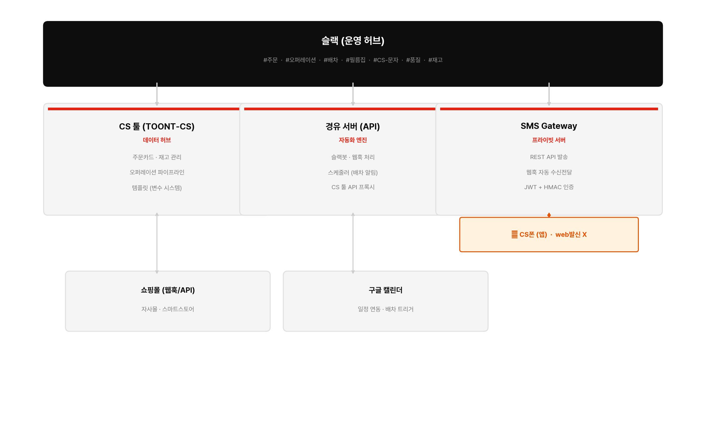
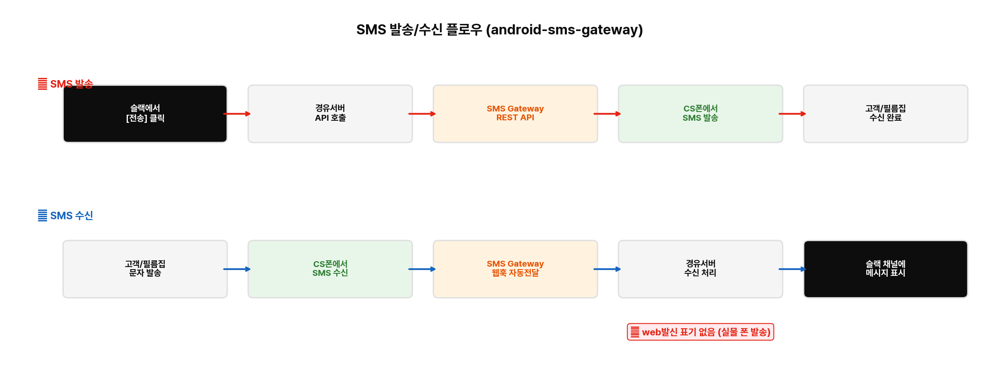
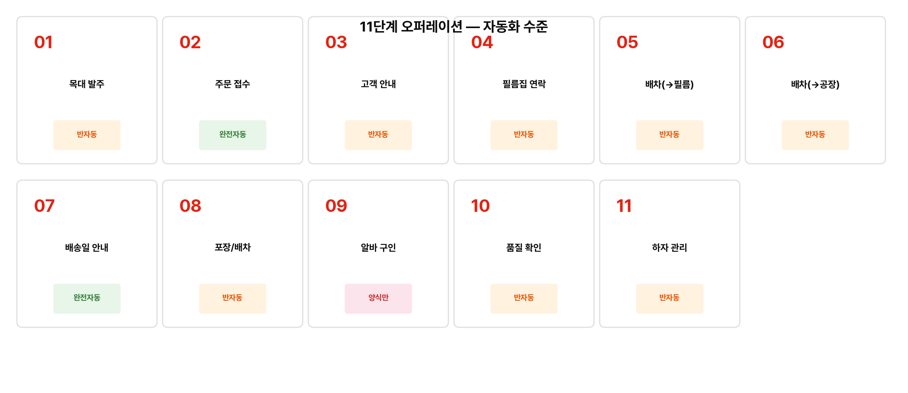
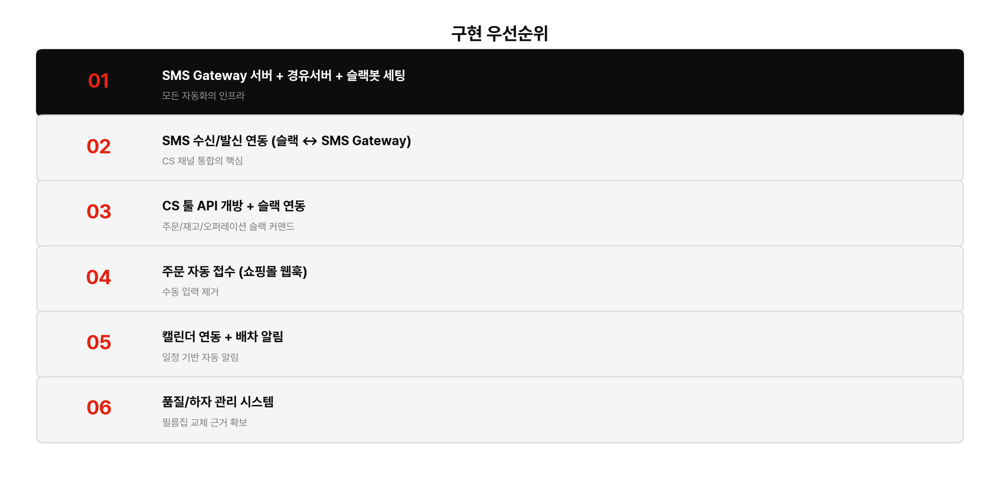

# TOONT 오퍼레이션 자동화 설계안

> 작성일: 2026-03-16
> 상태: Draft

## 1. 전체 아키텍처

### 핵심 구성요소

| 구성요소 | 역할 | 비고 |
|----------|------|------|
| **TOONT-CS** | 주문/재고/오퍼레이션/템플릿 관리 (데이터 허브) | cs.toont.co.kr |
| **슬랙** | 운영 허브 (알림, 커맨드, 승인) | 채널 기반 워크플로우 |
| **경유서버** | API 게이트웨이, 슬랙봇, 스케줄러 | Node.js/Next.js |
| **SMS Gateway** | SMS 수신/발신 REST API (web발신 X) | android-sms-gateway + 프라이빗 서버 |
| **CS폰** | SMS 실제 발송/수신 단말 | SMS Gateway 앱 설치 |
| **구글캘린더** | 일정 기반 알림 트리거 | CS 툴 연동 지원 |

### 아키텍처 다이어그램



<details>
<summary>텍스트 버전 (이미지 로딩 안 될 때)</summary>

```
┌─────────────────────────────────────────────────────┐
│                    슬랙 (운영 허브)                     │
│  #주문 / #오퍼레이션 / #배차 / #필름집 / #CS-문자 / #품질 / #재고  │
└────────┬──────────────┬──────────────┬──────────────┘
         │              │              │
    ┌────▼────┐   ┌─────▼─────┐  ┌────▼─────────┐
    │ CS 툴   │   │ 경유 서버  │  │ SMS Gateway  │
    │(TOONT-CS)│   │ (API)    │  │ (프라이빗서버) │
    │ 주문관리 │   │ 슬랙봇    │  │ REST API     │
    │ 재고관리 │   │ 스케줄러   │  │ 웹훅 자동전달 │
    │ 오퍼레이션│   │ 웹훅처리   │  │ JWT 인증     │
    │ 템플릿   │◄──┤          │──►│      ↕       │
    └─────────┘   └──────────┘  │  CS폰 (앱)   │
         │              │       │  SMS 발신/수신 │
    ┌────▼────┐   ┌─────▼─────┐ │  web발신 X    │
    │ 쇼핑몰  │   │ 구글캘린더 │ └──────────────┘
    │ 웹훅/API │   │ 일정 연동  │
    └─────────┘   └───────────┘
```

</details>

### SMS Gateway 플로우



### SMS Gateway 구성 (android-sms-gateway)

- **프라이빗 서버**: Docker + MySQL/MariaDB + Nginx (경유서버와 동일 VPS 가능)
- **CS폰**: SMS Gateway 앱 설치 → 프라이빗 서버에 연결
- **SMS 발송**: 경유서버 → SMS Gateway REST API (`POST /3rdparty/v1/message`)
- **SMS 수신**: CS폰 → 웹훅 자동 전달 (`sms:received`) → 경유서버 → 슬랙
- **인증**: JWT Bearer Token + HMAC-SHA256 웹훅 서명
- **장점**: Tasker 대비 안정적, REST API 직접 호출, 웹훅 자동 전달, Docker 배포

---

## 2. 단계별 자동화 설계



### 2.1 공장 목대 재고 발주 (1단계)

- **현재**: 매달 공장에 전화/카톡으로 수량 요청
- **자동화 수준**: 반자동 (알림 + 발주 보조)
- **트리거**: 매월 특정일 or 재고 기준치 이하
- **동작**:
  - 슬랙 `#재고` 채널에 발주 필요 알림 + 현재 재고 수량
  - `/발주 wood-600 10개` 커맨드로 발주 메모 생성
  - 공장은 카톡이라 자동화 불가 → 발주 내용 복사 후 카톡에 붙여넣기
  - 입고 시 `/입고 wood-600 10개` → CS 툴 재고 자동 업데이트
- **CS 툴 수정**: 재고 최소 기준치 필드 추가

### 2.2 주문 접수 → 재고 확인 (2단계)

- **현재**: 쇼핑몰 주문 → 이메일 → 수동 입력
- **자동화 수준**: 완전 자동 (웹훅 연동 시)
- **플로우**:
  1. 쇼핑몰 주문 발생 → 경유서버 웹훅 수신
  2. CS 툴 API: 주문카드 자동 생성 (고객명, 상품, 수량, 전화번호, 채널)
  3. CS 툴 API: 재고 자동 체크
     - 재고 충분 → 오퍼레이션 "접수"로 이동
     - 재고 부족 → "주문제작" 플래그 + 담당자 알림
  4. 슬랙 `#주문` 채널에 알림
- **쇼핑몰 연동**: 카페24/고도몰(웹훅), 스마트스토어(커머스API 폴링), 직접구매(수동/슬랙 커맨드)
- **확인 필요**: 자사몰 플랫폼 종류

### 2.3 고객 예상 제작일/배송일 안내 (3단계)

- **현재**: 유동적 관리, 기본 10일, CS 툴 템플릿 사용
- **자동화 수준**: 반자동 (템플릿 자동 채움 + 승인 후 발송)
- **플로우**:
  1. 주문 접수 완료 → 슬랙 알림 (예상 일정 자동 계산)
  2. 운영자가 [전송] 버튼 클릭
  3. 경유서버 → SMS Gateway API → CS폰에서 SMS 발송 (web발신 X)
  4. CS 툴 주문카드 메모에 발송 기록 자동 저장
- **핵심**: CS 툴 템플릿 변수 시스템 활용

### 2.4 필름집 연락 (4단계)

- **현재**: 전화/문자, 고정 1곳, 슬랙 불가
- **자동화 수준**: 반자동 (SMS 자동 발송 + 일정 등록)
- **플로우**:
  1. 운영자가 `/필름작업요청` → 수량/일정 확인
  2. [문자 전송] → SMS Gateway API → CS폰 → 필름집 SMS
  3. 구글캘린더에 작업 일정 자동 등록
  4. CS 툴 오퍼레이션 → "제작" 이동
- **필름집 회신**: SMS 수신 → SMS Gateway 웹훅 → 경유서버 → 슬랙 `#필름집` 채널
- **리드타임**: 기본 2일 (수→금) 자동 계산

### 2.5 배차 관리 (5~6단계)

- **현재**: 문자/카톡, 3회 발생 (공장↔필름집↔고객)
- **자동화 수준**: 반자동 (일정 기반 알림 + SMS 발송)
- **배차 포인트**:
  1. 공장 → 필름집 (작업 시작일)
  2. 필름집 → 공장 (작업 완료일)
  3. 공장 → 고객 (배송일)
- **플로우**:
  1. 캘린더 일정 기준 하루 전 슬랙 알림
  2. [우리퀵 문자] or [부산기사 문자] 버튼
  3. SMS Gateway API → CS폰 → SMS 발송
  4. 이미 배차됨 체크 시 알림 스킵
- **부산 기사님**: 공장에서 카톡 직접 소통 → 자동화 제외

### 2.6 배송일 최종 안내 (7단계)

- **자동화 수준**: 완전 자동 (승인 기반)
- **트리거**: CS 툴 오퍼레이션 → "배송중" 전환 시
- **동작**: 슬랙 알림 → 승인 → SMS Gateway API → CS폰 SMS 발송

### 2.7 포장 & 최종 배차 (8단계)

- **자동화 수준**: 알림 + 체크리스트
- **트리거**: 배송일 이틀 전
- **동작**: 슬랙에 포장 준비 체크리스트 자동 생성

### 2.8 당근 알바 구인 (9단계)

- **자동화 수준**: 양식 자동 생성 (글 올리기는 수동)
- **트리거**: 배송일 3일 전
- **동작**: 슬랙에 당근 구인글 양식 자동 생성 → 복사해서 당근에 게시
- **한계**: 당근 API 없음 → 글 올리기/응대는 수동

### 2.9 품질/하자 관리 (10~11단계)

- **현재**: 33% 하자율, 프로세스 정비 필요
- **자동화 수준**: 체크리스트 + 하자 보고서 자동 생성
- **플로우**:
  1. 배송 완료 → 슬랙 품질 체크리스트 자동 생성
  2. 하자 발견 시 `/하자보고 [고객명] [유형] [수량]`
  3. `#품질` 채널에 하자 보고서 생성
  4. 하자 이력 DB에 자동 기록
  5. 월간 하자율 자동 집계
- **핵심**: 필름집 교체 근거 확보를 위한 데이터 축적

---

## 3. 경유서버 API 설계

```
경유서버 (Node.js/Next.js API Routes)
│
├── /api/webhook/order        ← 쇼핑몰 주문 웹훅 수신
├── /api/webhook/sms          ← SMS Gateway 웹훅 수신 (sms:received 등)
├── /api/slack/command        ← 슬랙 슬래시 커맨드 처리
├── /api/slack/action         ← 슬랙 버튼 클릭 액션 처리
├── /api/sms/send             ← SMS Gateway API로 SMS 발송 요청
├── /api/cs-tool/*            ← CS 툴 API 프록시
├── /api/calendar/*           ← 구글캘린더 연동
└── /cron/daily-check         ← 매일 배차/마감 체크 스케줄러
```

---

## 4. 슬랙 채널 구조

| 채널 | 용도 |
|------|------|
| `#주문` | 새 주문 알림, 주문 상태 변경 |
| `#오퍼레이션` | 제작/배송 파이프라인 상태 |
| `#배차` | 배차 요청/완료 알림 |
| `#필름집` | 필름집 SMS 수신/발신 |
| `#CS-문자` | 고객 SMS 수신/발신 (SMS Gateway 연동) |
| `#품질` | 하자 보고/이력 관리 |
| `#재고` | 재고 알림, 입출고 기록 |

---

## 5. 슬랙 커맨드

| 커맨드 | 동작 |
|--------|------|
| `/주문추가 [고객명] [상품] [수량]` | CS 툴에 주문 추가 |
| `/재고` | 현재 재고 현황 조회 |
| `/입고 [SKU] [수량]` | 재고 입고 처리 |
| `/출고 [SKU] [수량]` | 재고 출고 처리 |
| `/발주 [SKU] [수량]` | 공장 발주 메모 생성 |
| `/필름작업요청` | 필름집에 작업 요청 SMS |
| `/배차 [구간] [날짜]` | 배차 요청 SMS |
| `/문자 [번호] [내용]` | 임의 SMS 발송 |
| `/하자보고 [고객명] [유형] [수량]` | 하자 보고서 생성 |

---

## 6. CS 툴 수정 필요 사항

| 항목 | 내용 | 우선순위 |
|------|------|----------|
| API 엔드포인트 추가 | 주문 CRUD, 재고 조회/업데이트, 오퍼레이션 상태 변경 | 높음 |
| 재고 최소 기준치 필드 | 기준치 이하 시 알림 트리거 | 높음 |
| 배차 관리 기능 | 구간/기사/상태 관리 (현재 없음) | 중간 |
| 하자 이력 관리 | 유형/원인/횟수/비용 기록 (현재 없음) | 중간 |
| 웹훅 발송 기능 | 상태 변경 시 외부(슬랙봇)에 알림 | 높음 |
| 템플릿 수정 | 기존 템플릿 문제 수정 | 중간 |

---

## 7. 구현 우선순위



| 순서 | 모듈 | 이유 |
|------|------|------|
| **1** | SMS Gateway 프라이빗 서버 + 경유서버 + 슬랙봇 기본 세팅 | 모든 자동화의 인프라 |
| **2** | SMS 수신/발신 연동 (슬랙 ↔ SMS Gateway API) | CS 채널 통합의 핵심 |
| **3** | CS 툴 API 개방 + 슬랙 연동 | 주문/재고/오퍼레이션 조회/업데이트 |
| **4** | 주문 자동 접수 (쇼핑몰 웹훅) | 수동 입력 제거 |
| **5** | 캘린더 연동 + 배차 알림 | 일정 기반 자동 알림 |
| **6** | 품질/하자 관리 시스템 | 필름집 교체 근거 확보 |
